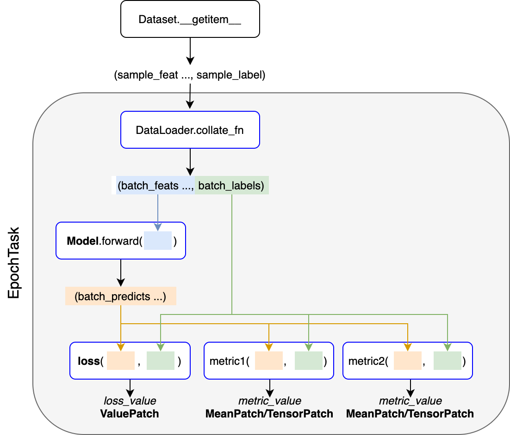

# DeepEpochs

Pytorch深度学习模型训练工具。

### 安装

```bash
pip install deepepochs
```

### 使用

#### 数据要求

- 训练集、验证集和测试集是`torch.utils.data.Dataloader`对象
- `Dataloaer`所构造的每个mini-batch数据（`collate_fn`返回值）是一个`tuple`或`list`，其中最后一个是标签
  - 如果训练中不需要标签，则需将最后一项置为`None`

#### 指标计算

- 每个指标是一个函数
  - 有两个参数，分别为模型预测和数据标签
  - 返回值为当前mini-batch上计算的指标值或字典
  - 支持基于`torchmetrics.functional`定义指标

#### 应用

```python
import torch
from torch import nn
from torch.nn import functional as F
from torchvision.datasets import MNIST
from torchvision import transforms
from torch.utils.data import DataLoader, random_split
from deepepochs import Trainer

# 1. --- datasets
data_dir = './datasets'
transform = transforms.Compose([transforms.ToTensor(), transforms.Normalize((0.1307,), (0.3081,))])
mnist_full = MNIST(data_dir, train=True, transform=transform, download=True)
train_ds, val_ds = random_split(mnist_full, [55000, 5000])
test_ds = MNIST(data_dir, train=False, transform=transform, download=True)
train_dl = DataLoader(train_ds, batch_size=32)
val_dl = DataLoader(val_ds, batch_size=32)
test_dl = DataLoader(test_ds, batch_size=32)

# 2. --- model
channels, width, height = (1, 28, 28)
model = nn.Sequential(
    nn.Flatten(),
    nn.Linear(channels * width * height, 64), nn.ReLU(), nn.Dropout(0.1),
    nn.Linear(64, 64), nn.ReLU(), nn.Dropout(0.1),
    nn.Linear(64, 10)
)

# 3. --- optimizer
opt = torch.optim.Adam(model.parameters(), lr=2e-4)

# 4. --- train
trainer = Trainer(model, F.cross_entropy, opt, epochs=2)  # 训练器
trainer.fit(train_dl, val_dl)                             # 训练、验证
trainer.test(test_dl)                                     # 测试
```

### 示例

|序号|功能说明|代码|
| ---- | ---- | ---- |
|1|基本使用|[examples/1-basic.py](examples/1-basic.py)|
|2|trainer、fit方法、test方法的常用参数|[examples/2-basic-params.py](examples/2-basic-params.py)|
|3|模型性能评价指标的使用|[examples/3-metrics.py](examples/3-metrics.py)|
|4|Checkpoint和EarlyStop|[examples/4-checkpoint-earlystop.py](examples/4-checkpoint-earlystop.py)|
|5|寻找适当的学习率|[examples/5-lr-find.py](examples/5-lr-find.py)|
|6|利用Tensorboad记录训练过程|[examples/6-logger.py](examples/6-logger.py)|
|7|利用tensorboard记录与可视化超参数|[examples/7-log-hyperparameters.py](examples/7-log-hyperparameters.py)|
|8|分析、解释或可视化模型的预测效果|[examples/8-interprete.py](examples/8-interprete.py)|
|9|学习率调度|[examples/9-lr-schedule.py](examples/9-lr-schedule.py)|
|10|使用多个优化器|[examples/10-multi-optimizers.py](examples/10-multi-optimizers.py)|
|11|在训练、验证、测试中使用多个Dataloader|[examples/11-multi-dataloaders.py](examples/11-multi-dataloaders.py)|
|12|基于图神经网络的节点分类|[examples/12-node-classification.py](examples/12-node-classification.py)|
|13|模型前向输出和梯度的可视化|[examples/13-weight-grad-visualize.py](examples/13-weight-grad-visualize.py)|
|14|自定义Callback|[examples/14-costomize-callback.py](examples/14-costomize-callback.py)|
|15|通过`TrainerBase`定制`train_step`和`evaluate_step`|[examples/15-customize-steps-1.py](examples/15-customize-steps-1.py)|
|16|通过`EpochTask`定制`train_step`和`eval_step`和`test_step`|[examples/16-customize-steps-2.py](examples/16-customize-steps-2.py)|
|17|通过`EpochTask`定制`step`|[examples/17-costomize-steps-3.py](examples/17-costomize-steps-3.py)|
|18|内置Patch的使用|[examples/18-use_patches.py](examples/18-use_patches.py)|
|19|自定义Patch|[examples/19-customize-patch.py](examples/19-customize-patch.py)|
|20|分布式训练、混合精度训练|[examples/20-accelerate.py](examples/20-accelerate.py)|

### 定制

- 方法1（__示例14__）
    - 第1步：继承`deepepochs.Callback`类，定制满足需要的`Callback`
    - 第2步：使用`deepepochs.Trainer`训练模型，将定制的`Callback`对象作为`Trainer`的`callbacks`参数
- 方法2（__示例15__）
    - 第1步：继承`deepepochs.TrainerBase`类定制满足需要的`Trainer`，实现`step`、`train_step`、`val_step`、`test_step`或`evaluate_step`方法，它们的定义方法完全相同
      - 参数
          - `batch_x`：     一个mini-batch的模型输入数据
          - `batch_y`：     一个mini-batch的标签
          - `**step_args`：可变参数字典，即`EpochTask`的`step_args`参数
      - 返回值为`None`或字典
          - key：指标名称
          - value：`deepepochs.PatchBase`子类对象，可用的Patch有（__示例18__）
              - `ValuePatch`：    根据每个mini-batch指标均值（提前计算好）和batch_size，累积计算Epoch指标均值
              - `TensorPatch`：   保存每个mini-batch的(preds, targets)，Epoch指标利用所有mini-batch的(preds, targets)数据重新计算
              - `MeanPatch`：     保存每个batch指标均值，Epoch指标值利用每个mini-batch的均值计算
                  - 一般`MeanPatch`与`TensorPatch`结果相同，但占用存储空间更小、运算速度更快
                  - 不可用于计算'precision', 'recall', 'f1', 'fbeta'等指标
              - `ConfusionPatch`：用于计算基于混淆矩阵的指标，包括'accuracy', 'precision', 'recall', 'f1', 'fbeta'等
          - 也可以继承`PatchBase`定义新的Patch，需要实现如下方法 __（示例19）__
              - `PatchBase.add`
                - 用于将两个Patch对象相加得到更大的Patch对象
              - `PatchBase.forward`
                - 用于计算指标，返回指标值或字典
    - 第2步：调用定制`Trainer`训练模型。
- 方法（__示例16、17__）
    - 第1步：继承`deepepochs.EpochTask`类，在其中定义`step`、`train_step`、`val_step`、`test_step`或`evaluate_step`方法
      - 它们的定义方式与`Trainer`中的`*step`方法相同
      - `step`方法优先级最高，即可用于训练也可用于验证和测试（定义了`step`方法，其他方法就会失效）
      - `val_step`、`test_step`优先级高于`evaluate_step`方法
      - `EpochTask`中的`*step`方法优先级高于`Trainer`中的`*step`方法
      - `EpochTask`的`__ini__`方法的`**step_args`会被注入`*step`方法的`step_args` 参数
    - 第2步：使用新的`EpochTask`任务训练
      - 将`EpochTask`对象作为`Trainer.fit`中`train_tasks`和`val_tasks`的参数值，或者`Trainer.test`方法中`tasks`的参数值

### 数据流图


