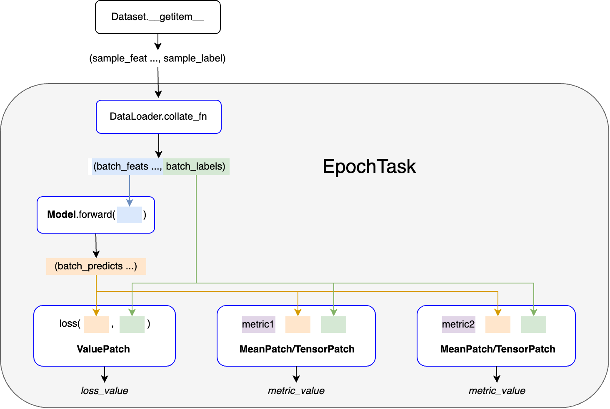

# DeepEpochs

Pytorch深度学习模型训练工具。

### 安装

```bash
pip install deepepochs
```

### 使用

#### 数据要求

- 训练集、验证集和测试集是`torch.utils.data.Dataloader`对象
- `Dataloaer`中每个mini-batch数据是一个`tuple`或`list`，其中最后一个是标签
  - 如果数据不包含标签，则请将最后一项置为`None`

#### 指标计算

- 每个指标是一个函数
  - 它有两个参数，分别为模型的预测结果和标签
  - 返回值为当前mini-batch上的指标值

#### 常规训练流程应用示例

```python
from deepepochs import Trainer, CheckCallback, rename, EpochTask
import torch
from torch import nn
from torch.nn import functional as F
from torchvision.datasets import MNIST
from torchvision import transforms
from torch.utils.data import DataLoader, random_split
from torchmetrics import functional as MF

# datasets
data_dir = './dataset'
transform = transforms.Compose([transforms.ToTensor(), transforms.Normalize((0.1307,), (0.3081,))])
mnist_full = MNIST(data_dir, train=True, transform=transform, download=True)
train_ds, val_ds, _ = random_split(mnist_full, [5000, 5000, 50000])
test_ds = MNIST(data_dir, train=False, transform=transform, download=True)

# dataloaders
train_dl = DataLoader(train_ds, batch_size=32)
val_dl = DataLoader(val_ds, batch_size=32)
test_dl = DataLoader(test_ds, batch_size=32)

# pytorch model
channels, width, height = (1, 28, 28)
model = nn.Sequential(
    nn.Flatten(),
    nn.Linear(channels * width * height, 64),
    nn.ReLU(),
    nn.Dropout(0.1),
    nn.Linear(64, 64),
    nn.ReLU(),
    nn.Dropout(0.1),
    nn.Linear(64, 10)
)

def acc(preds, targets):
    return MF.accuracy(preds, targets, task='multiclass', num_classes=10)

@rename('')
def multi_metrics(preds, targets):
    return {
        'p': MF.precision(preds, targets, task='multiclass', num_classes=10),
        'r': MF.recall(preds, targets, task='multiclass', num_classes=10)
        }


checker = CheckCallback('loss', on_stage='val', mode='min', patience=2)
opt = torch.optim.Adam(model.parameters(), lr=2e-4)

trainer = Trainer(model, F.cross_entropy, opt=opt, epochs=100, callbacks=checker, metrics=[acc])

# 应用示例1：自动加载Checkpoint
progress = trainer.fit(train_dl, val_dl, metrics=[multi_metrics], resume=True)
test_rst = trainer.test(test_dl)

# 应用示例2：定义EpochTask任务（一个Dataloader上的训练、验证或测试称为一个任务）
# t1 = EpochTask(train_dl, metrics=[acc])
# t2 = EpochTask(val_dl, metrics=[multi_metrics], do_loss=True)
# progress = trainer.fit(train_tasks=t1, val_tasks=t2)
# test_rst = trainer.test(tasks=t2)

# 应用示例3：多任务训练、验证和测试
# t1 = EpochTask(train_dl, metrics=[acc])
# t2 = EpochTask(val_dl, metrics=[acc, multi_metrics], do_loss=True)
# progress = trainer.fit(train_dl, val_tasks=[t1, t2])
# test_rst = trainer.test(tasks=[t1, t2])
```

#### 非常规训练流程

- 方法1:
    - 第1步：继承`deepepochs.Callback`类，定制满足需要的`Callback`
    - 第2步：使用`deepepochs.Trainer`训练模型，将定制的`Callback`对象作为`Trainer`的`callbacks`参数
- 方法2:
    - 第1步：继承`deepepochs.TrainerBase`类，定制满足需要的`Trainer`，实现`step`、`train_step`、`val_step`、`test_step`或`evaluate_step`方法
        - 这些方法有三个参数
            - `batch_x`：     一个mini-batch的模型输入数据
            - `batch_y`：     一个mini-batch的标签
            -  `**step_args`：可变参数字典，包含`do_loss`、`metrics`等参数
        - 返回值为字典
            - key：指标名称
            - value：`DeepEpochs.PatchBase`子类对象，可用的Patch有
                - `ValuePatch`：    根据每个batch指标均值（提前计算好）和batch_size，累积计算Epoch指标均值
                - `TensorPatch`：   保存每个batch模型预测输出及标签，根据指定指标函数累积计算Epoch指标均值
                - `MeanPatch`：     保存每个batch指标均值，根据指定指标函数累积计算Epoch指标均值
                - `ConfusionPatch`：累积计算基于混淆矩阵的指标
                - 也可以继承`PatchBase`定义新的Patch（存在复杂指标运算的情况下）
                    - `PatchBase.add`方法
                    - `PatchBase.forward`方法
    - 第2步：调用定制`Trainer`训练模型。
- 方法3:
    - 第1步：继承`deepepochs.EpochTask`类，在其中定义`step`、`train_step`、`val_step`、`test_step`或`evaluate_step`方法
        - 它们的定义方式与`Trainer`中的`*step`方法相同
        - `step`方法优先级最高，即可用于训练也可用于验证和测试（定义了`step`方法，其他方法就会失效）
        - `val_step`、`test_step`优先级高于`evaluate_step`方法
        - `EpochTask`中的`*_step`方法优先级高于`Trainer`中的`*_step`方法
    - 第2步：使用新的`EpochTask`任务进行训练
        - 将`EpochTask`对象作为`Trainer.fit`中`train_tasks`和`val_tasks`的参数值，或者`Trainer.test`方法中`tasks`的参数值

#### 数据流图


